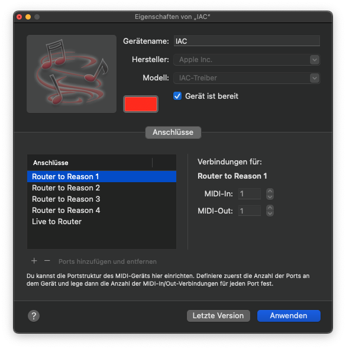

# Eight Track LR Router

_Routes MIDI messages from Ableton Live to Reason_

**Note:** This is an app exclusively for Macs, there is no Windows version!

## Getting started

### MIDI setup

The idea of this project is to use eight tracks in the Ableton Live session view to control up to 64 devices in the
Reason rack independently.

To make this work, you have to use the macOS app _Audio MIDI Setup_ to configure five new IAC ports. One port is used to
send MIDI messages from Live to _8tlr-router_, four ports are used to send MIDI messages from _8tl-router_ to Reason.



### Configuration file

After adding the ports using the _MIDI Studio_ in the _Audio MIDI Setup_ app, create a configuration file called
_8tlr-router.config.yaml_, either in your home directory, or whereever you are planning to run the _8tlr-router_.

The config file should define your MIDI ports like so:

```
---
portName:
  input: IAC Live to Router
  output:
    - IAC Router to Reason 1
    - IAC Router to Reason 2
    - IAC Router to Reason 3
    - IAC Router to Reason 4
```

### Download and installation

Download the latest version on the [release page](https://github.com/zapperment/8tlr-router-desktop/releases/).

Unzip and move the app contained in the zip file to your applications folder.

### “XYZ Is Damaged and Can’t Be Opened. You Should Move It To The Trash”

If you get this error, open up a terminal, go to the applications folder, and run this command:

```
sudo xattr -c Eight\ Track\ LR\ Router.app
```

You need admin privileges to do this.

This is, unfortunately, a security measure by Apple that prevents apps downloaded from the internet from getting
executed unless they are approved by Apple.

See discussion here: https://discussions.apple.com/thread/253714860?sortBy=best

## Development

### Initial setup

Clone this GitHub repository to your local file system.

Make sure you have the Node.js version that is specifiedv in _.nvmrc_ installed.

Make sure you have Yarn installed (run `corepack enable`).

Install dependencies:

```
yarn
```

Set up a _8tlr-router.config.yaml_ as explained above in section [Configuration file](#configuration-file).

### Running in local dev mode

Run in local dev mode with this command:

```
yarn start
```

This project uses [debug](https://www.npmjs.com/package/debug) for logging debug messages. They can help you understand
what's going on.

To run with debug messages on:

```
DEBUG=* yarn start
```

To show only debug messages from the 8TLR Router program, not from third-party-packages:

```
DEBUG=8tlr-router:* yarn start
```

You can show debug messages only from a spefific logger. For example, to see only logs for control change messages that
were sent out:

```
DEBUG=8tlr-router:midi:router:cc yarn start
```

### Publishing a new release

All changes should be introduced to the main branch via pull request. Use “squash and merge" to merge the PR.

Create a GitHub access token with _Settings_ → _Developer settings_ → _Personal access tokens_ → _Tokens (classic)_.

Grant the tokens access to scopes _repo_ and _write:packages_.

If you already have a token that has expired, you can use “regenerate token”.

Create a _.env_ file in the local repository clone root by copying _.env.example_.

Replace the bogus GitHub token in the _.env_ file with the real one.

Bump the version number in _package.json_ using [semantic versioning](https://semver.org/).

Commit and push the changes to the main branch using a conventional
[commit message](https://www.conventionalcommits.org/en/v1.0.0/), e.g. `chore: release v6.6.6`.

Run the _publish_ script:

```
yarn publish
```

After successfully running the _publish_ script, go to the
[releases page on GitHub](https://github.com/zapperment/8tlr-router-desktop/releases) — there should be a new release
draft for the version you have just published.

Click on the release draft, then click on the pencil iconm (“edit”).

Click on the “publish release”.

You can now download the release zip file and install it on you Mac, as described above in section
[Download and installation](#download-and-installation).
